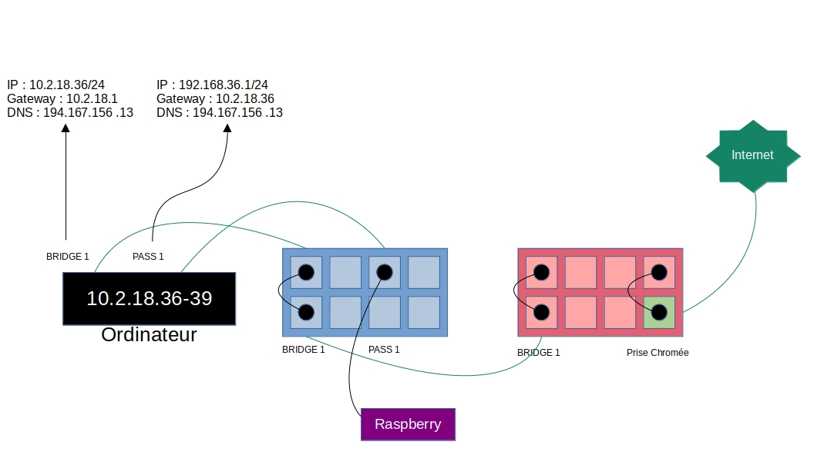
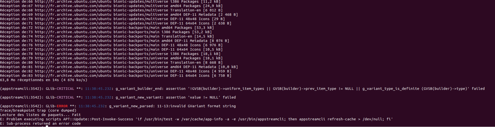

---

# Sommaire

1. Création de la VM
2. Installation de Raspberry Pi OS
    1. En utilisant RPi-imager
    2. Depuis le terminal
3. Branchements réalisés
4. Configuration basique de la VM
    1. Paramétrage des cartes réseau
        1. Avec RPi-imager
        2. Depuis le terminal
    2. Accès à internet depuis la VM
5. Installation et configuration de DHCP
    1. Installation
    2. Configuration
6. Récupération de l'addresse IP du Raspberry
    1. Avec dhcpd.leases
    2. Avec nmap
    3. Avec fping
7. Connexion SSH
8. Accéder à internet depuis le Raspberry

---

\vspace{2cm}

Durant ce compte-rendu, je vous montrerais comment configurer un serveur DHCP afin de pouvoir 
connecter automatiquement un Raspberry Pi au réseau de l'IUT et à internet. Nous aborderons 
différentes méthodes pour réaliser ces tâches, nous utiliserons tout d'abord les interfaces 
graphiques pour simplifier les configurations, mais nous utiliserons aussi le terminal afin 
d'automatiser ces opérations.

\pagebreak

# 1. Création de la VM

Configuration de la VM sur vi4rt.univ-pau.fr :

```
Nouvelle machine virtuelle

Nom de la machine   ubuntu
Disque dur          Ubuntu 18.04 (15.00Go)
Lecteur CD/DVD      Vide
Lecteur CD/DVD 2    Vide
Booster sur le      [ ]
         CDROM
Processeur(s)       2 vcpus
Memoire vive        2G
Cartes reseaux      2
Carte 1 attachee a  bridge1
Carte 2 attachee a  pass1
Dupliquer le port   [ ]
serie dans la VM

Options avancées (utiliser en connaissance de causes)

Ne pas utiliser virtio [ ]

```

# 2. Installation de Raspberry Pi OS

## 2.1. Avec RPi-imager

Afin de flasher la carte SD du Raspberry avec le système d'exploitation adapté, nous allons 
utiliser le logiciel fournit par Raspberry Pi nommé `rpi-imager`. Ce logiciel permet d'installer 
Raspberry Pi OS 32 bits et de configurer le Raspberry avant son allumage. Pour flasher la carte sd
du Raspberry, il suffit de sélectionner le système d'exploitation «Raspberry Pi OS 32 bits», d'ajouter
la micro-sd en tant que support de stockage, de modifier les paramètres par défaut en cliquant sur 
la roue dentée et enfin de cliquer sur le bouton écrire.

Paramètres à renseigner :

```
[X] Enable SSH
    (X) Use password authentification
    ( ) Allow public key authentification only
[X] Set username and password
    Username : pi
    Password : **** (modifier selon l'envie)
[ ] Configure wireless LAN
[ ] Set locale settings
```

## 2.2 Depuis le terminal

Pour cette partie, nous installerons et configurerons Raspberry Pi OS à l'aide d'un terminal. 
Tout d'abord, nous allons télécharger le fichier image de Raspberry Pi OS 
[ici](https://www.raspberrypi.com/software/operating-systems/) en sélectionnant «Raspberry Pi OS 
with desktop».

Pour vérifier l'intégrité du fichier téléchargé, nous pouvons 
vérifier le hash d'intégrité du fichier téléchargé comme ceci :

```
supervisor@ubuntu:~/Téléchargements# sha256sum 2022-09-22-raspios-bullseye-armhf.img.xz
4d8f38d014a807198996693b90cbeef94e19d9fd7fbefba7068db8df4d698cdd  2022-09-22-raspios-bullseye-armhf.img.xz
```

Ce hash est bien le même que celui présent sur le site de la fondation Raspberry Pi, le fichier est donc
intègre.

Ensuite,
nous devons décompresser ce fichier, pour ce faire nous allons utiliser le programme `unxz` en lui
donnant comme argument le fichier compressé en XZ :

```bash
unxz ~/Téléchargements/2022-09-22-raspios-bullseye-armhf.img.xz
```

Alors, nous installons Raspberry Pi OS sur une carte SD à l'aide de la commande DD :

```bash
sudo dd if=~/Téléchargements/2022-09-22-raspios-bullseye-armhf.img of=/dev/sdb bs=1M status=progress 
```

Dans cette commande :

 - _if_ a comme valeur l'image d'entrée
 - _of_ a comme valeur le périphérique de sortie
 - _status=progress_ permet d'afficher des informations sur la progression de l'opération
 - _bs=1M_ permet de définir le nombre d'octets que l'on peut écrire en même temps à 1M.

Puis, pour éditer la configuration du Raspberry Pi, nous allons monter la carte SD (ici rattachée 
au disque _/dev/sdb_) à notre ordinateur :

```bash
sudo mount /dev/sdb2 /media/supervisor/rootfs
sudo mount /dev/sdb1 /media/supervisor/boot
```

Pour activer ssh au démarrage du Raspberry Pi, il nous suffit ce créer un fichier vide nommé _ssh_
dans le répertoire _/media/supervisor/boot_. Cependant la configuration de ssh n'est pas terminée. En effet, 
l'utilisateur pi n'ayant pas de mot de passe par défaut, la connexion ssh sera impossible avec
celui-ci.

Afin de générer ce mot de passe, nous pouvons utiliser la fonctionalité _passwd_ du programme
_OpenSSL_. Cette fonctionalité permet de générer un mot de passe suivant la norme de hachage du
fichier _/media/supervisor/rootfs/etc/shadow_. Selon la norme de ce fichier, le hash à générer 
doit être structuré comme ceci : 

`$[fonction de hachage]$[salage]$[mot de passe haché]`

La fonction de hachage est indiquée par un numéro, le numéro 1 représente md5, 5 représente 
SHA-256 et 6 représente SHA-512. Puis, le salage permet de contrer les attaques classiques comme 
la force brute. Enfin, la dernière valeur est le mot de passe haché par la fonction sélectionnée. 

Pour cette SAE, nous utiliserons la fonction SHA-512. Alors pour générer le hash suivant cette
norme, il est possible de lancer les commandes suivantes :

```bash
sudo apt install openssl # On met à jour openssl
openssl passwd -6
```

Il suffira de renseigner et de confirmer son mot de passe pour générer l'expression souhaitée.

Après avoir généré cette valeur, nous pouvons la placer dans le deuxième champ de la ligne de 
l'utilisateur pi du fichier _/etc/shadow_, les champs étant séparés par «:».

Ensuite, il suffit d'ajouter la ligne suivante au fichier _/media/supervisor/rootfs/etc/ssh/sshd_config_ afin
d'interdire la connexion SSH en tant que root :

```
PermitRootLogin no
```

enfin, nous pouvons démonter la carte SD du répertoire /media/supervisor :

```bash
sudo umount /media/supervisor/*
```

Note : le -R permet de démonter la carte SD récursivement.

# 3. Branchements réalisés

Les câbles verts représentent les connexions préétablies.



# 4. Configuration basique de la VM

## 4.1. Paramétrage des cartes réseau

### 4.1.1. Depuis l'interface graphique

Nous avons configuré les paramètres de réseau des deux cartes de la machine virtuelle. La carte 
bridge1 possède une adresse ip appartenant à la plage d'ip du poste utilisé et est connectée à la 
prise chromée afin d'accéder à internet. Ainsi, son adresse ip sera 10.2.18.36 et sa passerelle 
sera 10.2.18.1. Son masque et son DNS seront 255.255.255.0 et 194.167.156.13.

```
Méthode IPv4    ( ) Automatique (DHCP)  ( ) Réseau local seulement
                (X) Manuel              ( ) Désactiver

Adresses

|Adresse     |Masque de réseau |Passerelle|
|------------+-----------------+----------|
|10.2.18.36  |255.255.255.0    |10.2.18.1 |

DNS

[194.167.156.13]
```

La carte PASS1 aura comme adresse ip 192.168.36.1, celle-ci n'a pas d'importance. Sa passerelle 
sera 10.2.18.36 afin que celle-ci soit reliée à internet. Son masque et son DNS sont les mêmes 
que ceux de bridge1.

```
Méthode IPv4    ( ) Automatique (DHCP)  ( ) Réseau local seulement
                (X) Manuel              ( ) Désactiver

Adresses

|   Adresse   | Masque de réseau | Passerelle |
|-------------+------------------+------------|
|192.168.36.1 |255.255.255.0     |10.2.18.36  |

DNS

[194.167.156.13]
```

### 4.1.2. Depuis le terminal

Il est aussi possible de configurer les cartes réseau depuis le terminal à l'aide de la commande 
`nmcli` du logiciel NetworkManager. Dans notre cas, les cartes bridge1 et pass1 sont rattachées
respectivement aux connexions «Connexion filaire 1» et «Connexion filaire 2».

Pour modifier leurs configurations, on peut utiliser ces commandes :

```bash
nmcli con mod Connexion\ filaire\ 1 ipv4.addresses 10.2.18.36/24 \
    ipv4.gateway 10.2.18.1 ipv4.dns 194.167.156.13 ipv4.method manual

nmcli con mod Connexion\ filaire\ 2 ipv4.addresses 192.168.36.1/24 \
    ipv4.gateway 10.2.18.36 ipv4.dns 194.167.156.13 ipv4.method manual
```

Ensuite, nous pouvons relancer ces connexions afin d'appliquer les changements effectués :

```bash
nmcli con down Connexion\ filaire\ 1
nmcli con up Connexion\ filaire\ 1

nmcli con down Connexion\ filaire\ 2
nmcli con up Connexion\ filaire\ 2
```

## 4.2. Accès à internet depuis la VM

Enfin, pour accéder à internet, nous devons définir le proxy utilisé par la machine virtuelle 
comme étant celui de l'université :

```bash
export http_proxy="http://cache.univ-pau.fr:3128"
export https_proxy="http://cache.univ-pau.fr:3128"
```

On peut vérifier le fonctionnement de notre configuration en pingant par exemple _archlinux.org_
en IPv4 :

```bash
ping -4 archlinux.org
```

# 5. Installation et configuration de DHCP

## 5.1. Installation

Avant de pouvoir installer DHCP, nous avons fait face à une erreur du gestionnaire de paquets 
d'ubuntu (voir figure en fin de partie). Après quelques recherches, nous résolûmes cette erreur en
rentrant la commande suivante :

```bash
sudo apt install --reinstall libappstream4
```

Alors, nous pouvons enfin mettre à jour les dépôts d'APT pour installer DHCP :

```bash
sudo apt update && sudo apt install isc-dhcp-server
```



## 5.2. Configuration

Désormais, nous allons configurer le serveur DHCP. Pour m'aider, j'ai utilisé la 
[documentation Ubuntu du paquet isc-dhcp-server](https://doc.ubuntu-fr.org/isc-dhcp-server).
Voici le contenu du fichier de configuration _/etc/dhcp/dhcpd.conf_ :

```
default-lease-time 600;
max-lease-time 7200;

subnet 192.168.36.0 netmask 255.255.255.0 {
    range 192.168.36.2 192.168.36.254;
    option routers 192.168.36.1;
    option domain-name-servers 194.167.156.13;
}
```

Les deux premières lignes de ce fichier indiquent que le serveur DHCP attribuera une ip au client
pour une durée de 600 secondes,
et si le client renseigne lui-même cette valeur, celle-ci ne peut pas dépasser 7200 secondes. 
Puis, les lignes restantes definissent l'adresse et le masque de réseau utilisés par le serveur, 
les adresses du routeur et du DNS fournies aux clients et les adresses IP
attribuables aux clients.

Puis, nous devons définir l'interface utilisée par le serveur DHCP. Pour ce faire, on peut éditer
le fichier _/etc/default/isc-dhcp-server_ :

```
INTERFACESv4="ens4"
```

Enfin, nous pouvons lancer le service DHCP et l'activer au démarrage à l'aide de la commande 
suivante :

```bash
sudo systemctl enable --now isc-dhcp-server.service
```

# 6. Récupération de l'addresse IP du Raspberry

## 6.1. Avec dhcpd.leases

Après avoir brancher le Raspberry, il existe plusieurs méthodes pour récupérer son adresse ip.
Nous pouvons la récupérer à l'aide du fichier des baux généré par `isc-dhcp-server`.
Ce fichier est _/var/lib/dhcpd.leases_ et ressemble à ceci :

```
lease 192.168.36.2 {
  starts 4 2023/01/05 09:59:47;
  ends 4 2023/01/05 10:09:47;
  cltt 4 2023/01/05 09:59:47;
  binding state active;
  next binding state free;
  rewind binding state free;
  hardware ethernet e4:5f:01:1e:0c:0a;
  uid "\001\344_\001\036\014\012";
  set vendor-class-identifier = "dhcpcd-8.1.2:Linux-5.15.61-v7l+:armv7l:BCM2711";
  client-hostname "raspberrypi";
}
```

On peut bien voir que l'adresse IP 192.168.36.2 a été attribuée au Raspberry peu de temps après
l'avoir connecté.

## 6.2. Avec nmap

Installer nmap :

```bash
sudo apt install nmap
```

Utiliser nmap avec la commande suivante :

```bash
nmap -sP 192.168.36.0/24
```

Paramètre de la commande :

 - -sP: Ping Scan - Ne fait que déterminer si les hôtes sont en ligne

Cette commande donne le résultat suivant :

```
supervisor@ubuntu:~# nmap -sP 192.168.36.0/24

Starting Nmap 7.60 ( https://nmap.org ) at 2022-11-16 11:12 CET
Nmap scan report for 192.168.36.2
Host is up (0.00063s latency).
MAC Address: 08:8F:C3:2F:55:22 (Unknown)
Nmap scan report for ubuntu (192.168.36.1)
Host is up.
Nmap done: 256 IP addresses (2 hosts up) scanned in 3.75 seconds
```

## 6.3. Avec fping

Installer fping :

```bash
sudo apt install fping
```

Utiliser fping avec la commande suivante :

```
supervisor@ubuntu:~# fping -g 192.168.36.0/24 -q -a
192.168.36.1
192.168.36.2
```

Paramètres de la commande :

 - -g : génère une liste d'adresses IP à ping avec la notation CIDR
 - -q : cache les messages d'erreur
 - -a : affiche les systèmes en vie

# 7. Connexion SSH

Pour utiliser SSH, nous avons besoin de l'installer et de l'activer au démrrage :

```bash
sudo apt install ssh
sudo systemctl enable --now sshd.service
```

Enfin, nous pouvons nous connecter au Raspberry depuis le serveur DHCP à l'aide de cette
commande :

```bash
ssh pi@192.168.36.2
```

Cette commande permet d'ouvrir un shell sécurisé en tant que _pi_ sur la machine ayant comme 
addresse IP 192.168.36.1. SSH demande ensuite de renseigner un mot de passe, il suffira d'écrire
celui définit à l'installation de Raspberry Pi OS.

# 8. Accéder à internet depuis le Raspberry

Tout d'abord, pour permettre au Raspberry Pi de sortir de son réseau local, nous devons
transformer le serveur DHCP en une sorte de routeur. Pour ce faire, il faut décommenter
la ligne ci-dessous dans le fichier _/etc/sysctl.conf_ :

```
net.ipv4.ip_forward=1
```

Et recharger la configuration sysctl avec cette commande :

```bash
sudo sysctl -p
```

De plus, on doit activer le NAT sur notre passerelle afin que l'addresse IP du
Raspberry soit remplacée par celle de sa passerelle lors de l'envoi de paquets à l'exterieur du
réseau local.

Pour ce faire, j'ai décidé d'utiliser la commande `iptables` comme ceci :

```bash
iptables -t nat -A POSTROUTING -o ens3 -j MASQUERADE
```

Explication de la commande :

 - La valeur _POSTROUTING_ de l'option -A permet d'executer le _MASQUERADE_ juste avant la sortie 
     du paquet de l'interface _ens3_.
 - La valeur _nat_ de l'option -t permet quand à elle de consulter la table quand un nouveau paquet
     passe par la passerelle.
 - L'argument ens3 de l'option -o est le nom de la carte réseau de sortie des paquets
 - L'algorithme _MASQUERADE_ de l'option -j permet à la passerelle de se souvenir des paquets 
     tranférés et de les modifier afin de changer leur IP source lors de leur envoi.
     Lors du retour du paquet, cet algorithme consulte sa table des connexions masquées 
     établies pour voir si le datagramme appartient affectivement
     à un appareil du réseau local. Si c'est le cas, il annule les modifications réalisées à 
     l'aller du datagramme et le transmet au réseau local.

La table de routage du serveur DHCP devrait ressembler à ceci :

```
supervisor@ubuntu:~# ip route
default via 10.2.18.1 dev ens3 proto static scope src 10.2.18.36 metric 100
10.2.18.0/24 dev ens3 proto kernel scope link src 10.2.18.36 metric 100
10.2.18.36 dev ens4 proto static scope link metric 100
192.168.36.0/24 dev ens4 proto kernel scope link src 192.168.36.1 metric 100
```

Enfin, afin de mettre à jour les interfaces réseau, il suffit de redémarrer le service 
`networking` :

```bash
sudo systemctl restart networking
```

Normalement, le Raspberry devrait avoir accès à internet. Pour tester la connection, nous pouvons 
tenter de faire une requête HTTP au site web _archlinux.org_ :

```bash
curl -I https://archlinux.org/
```

Cette commande nous retourne l'en-tête HTTP de la réponse du serveur web _archlinux.org:443_.
Dans cet en-tête, on y lit en première ligne _HTTP/2 200_, le code 200 signifie que la requête 
HTTP est un succès, notre Raspberry Pi est donc bien connectée à internet.

\pagebreak

# Ressources utilisées

[Documentation Ubuntu isc-dhcp-server](https://doc.ubuntu-fr.org/isc-dhcp-server)

[Lire les baux des adresses IP](https://askubuntu.com/questions/265504/how-to-monitor-dhcp-leased-ip-address)

[Acceder à internet depuis le client](https://memo-linux.com/configurer-un-simple-petit-routeur-nat-sous-debian-jessie/)

[Utiliser nmap](https://wiki.archlinux.org/title/Nmap)

[Utiliser fping](https://fping.org/fping.1.html)

[Configuration des cartes réseau avec nmcli](https://www.tecmint.com/nmcli-configure-network-connection/)

[Authentification SSH avec clef de chiffrement](https://help.ubuntu.com/community/SSH/OpenSSH/Keys)

[Stockage des mots de passe dans le fichier /etc/shadow](https://unix.stackexchange.com/questions/557319/how-to-know-if-password-in-etc-shadow-is-hashed-with-sha-or-md)

[Génération des mots de passe avec OpenSSL](https://www.openssl.org/docs/man3.1/man1/openssl-passwd.html)

[Utilité du salage des mots de passe](https://fr.wikipedia.org/wiki/Salage_(cryptographie))
