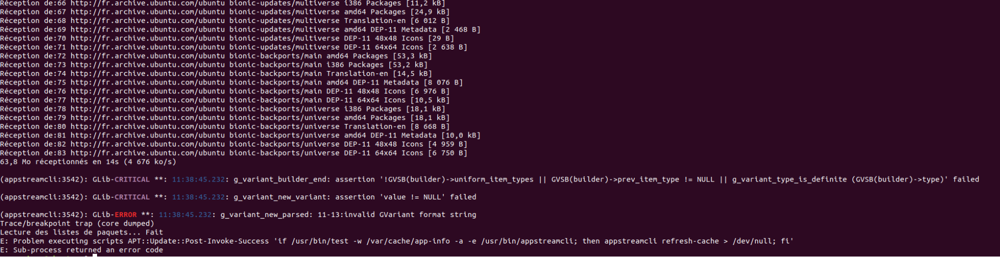

# sae102

Compte-rendu du SAE-12 de Antonin PONS.

---

# Sommaire

1. Création de la VM
2. Installation de Raspberry PI OS
3. Branchements réalisés
4. Configuration basique de la VM
5. Installation et configuration de DHCP
    1. Installation
    2. Configuration
6. Récupération de l'addresse IP de la Raspberry
    1. Avec dhcpd.leases
    2. Avec nmap
7. Connexion SSH

---

# 1. Création de la VM

# 2. Installation de Raspberry PI OS

Afin de flasher la carte SD de la Raspberry avec le système d'exploitation adapté, nous allons utiliser le logiciel
fournit par Raspberry PI nommé «rpi-imager». Ce logiciel permet d'installer Raspberry PI OS 32 bits et de
configurer la Raspberry avant son allumage. Pour flasher la Raspberry, il suffit de sélectionner le système
d'exploitation «Raspberry PI OS 32 bits», d'ajouter la micro-sd en tant que support de stockage, de modifier les
paramètres par défaut en cliquant sur la roue dentée et enfin de cliquer sur le bouton écrire.

Paramètres à renseigner :

```
[X] Enable SSH
    (X) Use password authentification
    ( ) Allow public key authentification only
[X] Set username and password
    Username : pi
    Password : **** (modifier selon l'envie)
[ ] Configure wireless LAN
[ ] Set locale settings
```

# 3. Branchements réalisés

# 4. Configuration basique de la VM

Enfin, pour accéder à internet, nous devons définir le proxy utilisé par la machine virtuelle comme étant celui de l'université :

```bash
export http_proxy="http://cache.univ-pau.fr:3128"
export https_proxy="http://cache.univ-pau.fr:3128"
```

On peut vérifier le fonctionnement de notre configuration en pingant google.fr en IPv4 :

```bash
ping -4 google.fr
```

# 5. Installation et configuration de DHCP

## 5.1. Installation

Avant de pouvoir installer DHCP, nous avons fait face à une erreur du gestionnaire de paquets d'ubuntu (voir figure en fin de partie).
Après quelques recherches, nous résolûmes cette erreur en rentrant la commande suivante :

```bash
sudo apt install --reinstall libappstream4
```

Alors, nous pouvons enfin mettre à jour les dépôts d'APT pour installer DHCP :

```bash
sudo apt update && sudo apt install isc-dhcp-server
```



## 5.2. Configuration

Tout d'abord, pour permettre au Raspberry PI de sortir de son réseau local, nous devons
transformer le serveur DHCP en une sorte de routeur. Pour ce faire, il faut décommenter
la ligne ci-dessous dans le fichier «/etc/sysctl.conf» :

```
net.ipv4.ip_forward=1
```

Et recharger la configuration sysctl avec cette commande :

```bash
sudo sysctl -p
```

Désormais, nous allons configurer le serveur DHCP. Pour nous aider, nous avons utilisé la 
[documentation Ubuntu du paquet isc-dhcp-server](https://doc.ubuntu-fr.org/isc-dhcp-server).
Voici notre fichier de configuration «/etc/dhcp/dhcpd.conf» :

```
default-lease-time 600;
max-lease-time 7200;

subnet 192.168.36.0 netmask 255.255.255.0 {
    range 192.168.36.2 192.168.36.254;
    option routers 192.168.36.1;
    option domain-name-servers 194.167.156.13;
}
```

Les deux premières lignes de ce fichier signifie que le serveur DHCP attribuera une ip au client pour une durée de 600 secondes,
et si le client renseigne lui-même cette valeur, celle-ci ne peut pas dépasser 7200 secondes. 
Puis, les lignes restantes definissent l'adresse et le masque de réseau utilisés par le serveur, 
les adresses du routeur et du DNS fournies aux clients et les adresses IP
attribuables aux clients.

Puis, nous devons définir l'interface utilisée par le serveur DHCP. Pour ce faire, nous pouvons éditer le
fichier «/etc/default/isc-dhcp-server» :

```
INTERFACESv4="ens4"
```

Enfin, nous pouvons lancer le service DHCP et l'activer au démarrage à l'aide de la commande suivante :

```bash
sudo systemctl enable --now isc-dhcp-server.service
```

# 6. Récupération de l'addresse IP de la Raspberry

## 6.1. Avec dhcpd.leases

Après avoir brancher la Raspberry, il existe plusieurs méthodes pour récupérer son adresse ip.
Nous pouvons la récupérer à l'aide du fichier des baux généré par isc-dhcp-server.
Ce fichier est «/var/lib/dhcpd.leases» et ressemble à ceci :

```
lease 192.168.36.2 {
  starts 2 2022/10/26 14:24:28;
  ends 3 2022/10/26 19:24:28;
   ...
   hardware ethernet 01:11:5b:12:34:56;
   ...
   client-hostname "raspberrypi";
}
```

On peut bien voir que l'adresse IP 192.168.36.2 a été attribuée à la Raspberry peu de temps après l'avoir connecté.
Nous allons alors pouvoir nous connecter à la Raspberry à l'aide de SSH.

## 6.2. Avec nmap

Installer nmap :

```bash
sudo apt install nmap net-tools
```

Utiliser nmap avec la commande suivante :

```bash
nmap -sP 192.168.36.0/24
```

# 7. Connexion SSH

Pour utiliser SSH, nous avons besoin de l'installer et de l'activer au démrrage :

```bash
sudo apt install ssh
sudo systemctl enable --now sshd.service
```

Enfin, nous pouvons nous connecter à la Raspberry depuis le serveur DHCP à l'aide de cette commande :

```bash
ssh pi@192.168.36.2
```

La commande ci-dessus va nous demander de renseigner un mot de passe, il suffira d'écrire celui définit à l'installation
de Raspberry PI OS.

# Documents utiles

[Documentation Ubuntu isc-dhcp-server](https://doc.ubuntu-fr.org/isc-dhcp-server)

[Lire les baux des adresses IP](https://askubuntu.com/questions/265504/how-to-monitor-dhcp-leased-ip-address)
